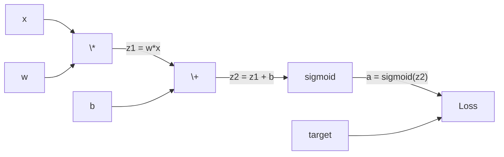
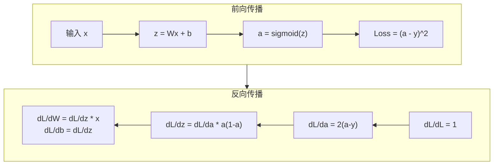
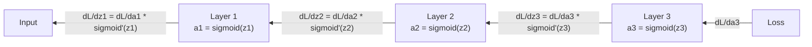

# 反向传播从零实现

> 反向传播是让学习成为可能的算法。没有它，神经网络只是昂贵的随机数生成器。

**类型：** Build | **语言：** Python | **前置要求：** 第 03.02 课（多层网络）| **时间：** ~120 分钟

## 学习目标

- 实现一个基于 Value 的 autograd 引擎，通过拓扑排序构建计算图并计算梯度
- 使用链式法则推导加法、乘法和 sigmoid 的反向传播
- 仅用手写的反向传播引擎训练一个多层网络来解决 XOR 和圆形分类问题
- 识别深层 sigmoid 网络中的梯度消失问题，并解释为什么梯度呈指数级衰减

## 问题所在

你的网络有一个隐藏层，768 个输入，3072 个输出。总共 2,359,296 个权重。它做出了错误的预测。是哪些权重导致了错误？逐个测试每个权重意味着 230 万次前向传播。反向传播在**一次**反向传递中计算出全部 230 万个梯度。这不是优化，这是可训练与不可能之间的分界线。

朴素的做法：拿一个权重，微调一点点，重新跑前向传播，测量损失是上升还是下降。这样就得到了该权重的梯度。然后对网络中每个权重都这样做。乘以数千个训练步数和数百万个数据点。你需要地质学时间尺度才能训练出任何有用的东西。

反向传播解决了这个问题。一次前向传播，一次反向传播，所有梯度计算完成。诀窍是微积分中的链式法则，系统地应用于计算图。这就是让深度学习变得实用的算法。

## 概念

### 链式法则应用于网络

你在第 01 阶段第 05 课中学过链式法则。快速回顾：如果 y = f(g(x))，那么 dy/dx = f'(g(x)) * g'(x)。你沿着链条相乘导数。

在神经网络中，"链条"是从输入到损失的一系列操作。每一层施加权重、加偏置、通过激活函数。损失函数将最终输出与目标进行比较。反向传播沿着这条链向后追溯，计算每个操作对误差的贡献。

### 计算图

每次前向传播构建一个图。每个节点是一个操作（乘、加、sigmoid）。每条边前向携带值，反向携带梯度。



前向传播：值从左向右流动。x 和 w 产生 z1 = w * x。加上 b 得到 z2。sigmoid 给出激活值 a。用损失函数将 a 与目标比较。

反向传播：梯度从右向左流动。从 dL/da 开始。乘以 da/dz2（sigmoid 导数）。得到 dL/dz2。拆分为 dL/db 和 dL/dz1。然后 dL/dw = dL/dz1 * x，dL/dx = dL/dz1 * w。

每个节点在反向传播中只有一个任务：接收来自上方的梯度，乘以其局部导数，向下传递。





### 梯度消失

sigmoid 将输出压缩在 0 到 1 之间。其导数始终小于 0.25。

```
sigmoid(z):     输出范围 [0, 1]
sigmoid'(z):    最大值 0.25（在 z = 0 时）

5 层后:   梯度 × 0.25^5  = 原始值的 0.001 倍
10 层后:  梯度 × 0.25^10 = 原始值的 0.000001 倍
```

这就是为什么深层 sigmoid 网络几乎无法训练。解决方案（ReLU 及其变体）是第 04 课的主题。

### 推导 2 层网络的梯度

前向传播：
```
z1 = W1 * x + b1
a1 = sigmoid(z1)
z2 = W2 * a1 + b2
a2 = sigmoid(z2)
L = (a2 - y)^2
```

反向传播（逐步应用链式法则）：
```
dL/da2 = 2(a2 - y)
da2/dz2 = a2 * (1 - a2)
dL/dz2 = dL/da2 * da2/dz2

dL/dW2 = dL/dz2 * a1
dL/db2 = dL/dz2

dL/da1 = dL/dz2 * W2
da1/dz1 = a1 * (1 - a1)
dL/dz1 = dL/da1 * da1/dz1

dL/dW1 = dL/dz1 * x
dL/db1 = dL/dz1
```

每个梯度都是从损失开始逐层追溯的局部导数的乘积。反向传播的全部内容就是这些。

## 动手构建

### 步骤 1：Value 节点

计算中的每个数字变成一个 Value。它存储数据、梯度和创建方式。

```python
class Value:
    def __init__(self, data, children=(), op=''):
        self.data = data
        self.grad = 0.0
        self._backward = lambda: None
        self._children = set(children)
        self._op = op

    def __repr__(self):
        return f"Value(data={self.data:.4f}, grad={self.grad:.4f})"
```

初始梯度为零，反向函数为空操作。`_children` 跟踪依赖关系以便拓扑排序。

### 步骤 2：带反向函数的运算

每个运算创建一个新的 Value，并定义梯度如何反向流过它。

```python
def __add__(self, other):
    other = other if isinstance(other, Value) else Value(other)
    out = Value(self.data + other.data, (self, other), '+')

    def _backward():
        self.grad += out.grad
        other.grad += out.grad

    out._backward = _backward
    return out

def __mul__(self, other):
    other = other if isinstance(other, Value) else Value(other)
    out = Value(self.data * other.data, (self, other), '*')

    def _backward():
        self.grad += other.data * out.grad
        other.grad += self.data * out.grad

    out._backward = _backward
    return out
```

- 加法导数 = 1，两个输入都直接获得输出的梯度
- 乘法导数 = 对方的输入值，每个输入获得对方的值乘以输出梯度
- `+=` 很关键：一个 Value 在多个运算中被使用，其梯度是所有路径梯度的总和

### 步骤 3：Sigmoid 和损失函数

```python
import math

def sigmoid(self):
    x = self.data
    x = max(-500, min(500, x))      # 防止 exp 溢出
    s = 1.0 / (1.0 + math.exp(-x))
    out = Value(s, (self,), 'sigmoid')

    def _backward():
        self.grad += (s * (1 - s)) * out.grad

    out._backward = _backward
    return out
```

sigmoid 导数 = s * (1 - s)，s 在前向传播中已计算，直接复用。

```python
def mse_loss(predicted, target):
    diff = predicted + Value(-target)
    return diff * diff
```

### 步骤 4：反向传播

拓扑排序确保节点按正确顺序处理——梯度在传播前已被完全累加。

```python
def backward(self):
    topo = []
    visited = set()

    def build_topo(v):
        if v not in visited:
            visited.add(v)
            for child in v._children:
                build_topo(child)
            topo.append(v)

    build_topo(self)
    self.grad = 1.0                       # dL/dL = 1
    for v in reversed(topo):              # 从损失向后遍历
        v._backward()
```

### 步骤 5：层和网络

```python
import random

class Neuron:
    def __init__(self, n_inputs):
        scale = (2.0 / n_inputs) ** 0.5   # He 初始化缩放
        self.weights = [Value(random.uniform(-scale, scale)) for _ in range(n_inputs)]
        self.bias = Value(0.0)

    def __call__(self, x):
        act = sum((wi * xi for wi, xi in zip(self.weights, x)), self.bias)
        return act.sigmoid()

    def parameters(self):
        return self.weights + [self.bias]


class Layer:
    def __init__(self, n_inputs, n_outputs):
        self.neurons = [Neuron(n_inputs) for _ in range(n_outputs)]

    def __call__(self, x):
        out = [n(x) for n in self.neurons]
        return out[0] if len(out) == 1 else out

    def parameters(self):
        params = []
        for n in self.neurons:
            params.extend(n.parameters())
        return params


class Network:
    def __init__(self, sizes):
        self.layers = [Layer(sizes[i], sizes[i + 1]) for i in range(len(sizes) - 1)]

    def __call__(self, x):
        for layer in self.layers:
            x = layer(x)
            if not isinstance(x, list):
                x = [x]
        return x[0] if len(x) == 1 else x

    def parameters(self):
        params = []
        for layer in self.layers:
            params.extend(layer.parameters())
        return params

    def zero_grad(self):
        for p in self.parameters():
            p.grad = 0.0
```

### 步骤 6：在 XOR 上训练

```python
random.seed(42)
net = Network([2, 4, 1])

xor_data = [
    ([0.0, 0.0], 0.0),
    ([0.0, 1.0], 1.0),
    ([1.0, 0.0], 1.0),
    ([1.0, 1.0], 0.0),
]

learning_rate = 1.0

for epoch in range(1000):
    total_loss = Value(0.0)
    for inputs, target in xor_data:
        x = [Value(i) for i in inputs]
        pred = net(x)
        loss = mse_loss(pred, target)
        total_loss = total_loss + loss

    net.zero_grad()
    total_loss.backward()

    for p in net.parameters():
        p.data -= learning_rate * p.grad

    if epoch % 100 == 0:
        print(f"Epoch {epoch:4d} | Loss: {total_loss.data:.6f}")
```

观察损失下降。从随机预测到正确的 XOR 输出，完全由反向传播驱动。

### 步骤 7：圆形分类

```python
random.seed(7)

def generate_circle_data(n=100):
    data = []
    for _ in range(n):
        x1 = random.uniform(-1.5, 1.5)
        x2 = random.uniform(-1.5, 1.5)
        label = 1.0 if x1 * x1 + x2 * x2 < 1.0 else 0.0
        data.append(([x1, x2], label))
    return data

circle_data = generate_circle_data(80)
circle_net = Network([2, 8, 1])
learning_rate = 0.5

for epoch in range(2000):
    random.shuffle(circle_data)
    total_loss_val = 0.0
    for inputs, target in circle_data:
        x = [Value(i) for i in inputs]
        pred = circle_net(x)
        loss = mse_loss(pred, target)
        circle_net.zero_grad()
        loss.backward()
        for p in circle_net.parameters():
            p.data -= learning_rate * p.grad
        total_loss_val += loss.data

    if epoch % 200 == 0:
        correct = sum(1 for inp, tgt in circle_data
                      if (1.0 if circle_net([Value(i) for i in inp]).data > 0.5 else 0.0) == tgt)
        print(f"Epoch {epoch:4d} | Loss: {total_loss_val:.4f} | Acc: {correct/len(circle_data)*100:.1f}%")
```

无需手动调参。网络自行发现圆形决策边界。这就是反向传播的力量。

## 使用 PyTorch

PyTorch 用几行代码完成以上所有事情。核心理念完全相同。

```python
import torch
import torch.nn as nn

model = nn.Sequential(
    nn.Linear(2, 4),
    nn.Sigmoid(),
    nn.Linear(4, 1),
    nn.Sigmoid(),
)
optimizer = torch.optim.SGD(model.parameters(), lr=1.0)
criterion = nn.MSELoss()

X = torch.tensor([[0,0],[0,1],[1,0],[1,1]], dtype=torch.float32)
y = torch.tensor([[0],[1],[1],[0]], dtype=torch.float32)

for epoch in range(1000):
    pred = model(X)
    loss = criterion(pred, y)
    optimizer.zero_grad()
    loss.backward()
    optimizer.step()
```

对应关系：
| 你的代码 | PyTorch |
|----------|---------|
| `total_loss.backward()` | `loss.backward()` |
| `p.data -= lr * p.grad` | `optimizer.step()` |
| `net.zero_grad()` | `optimizer.zero_grad()` |

## 练习

1. 为 Value 类添加 `__sub__` 和 `__neg__` 方法，验证 (a - b)^2 的梯度
2. 添加 `relu` 方法（输出 max(0,x)，导数 1 或 0），替换 sigmoid 训练 XOR，比较收敛速度
3. 实现 `__pow__` 方法，用 `(pred - target)**2` 替换 `mse_loss`
4. 添加梯度裁剪（裁剪到 [-1,1]），训练 4+ 层 sigmoid 网络，比较有无裁剪的损失曲线
5. 训练后打印每层每个参数的梯度大小，找出梯度最小的层——可视化梯度消失

## 关键术语

| 术语 | 实际含义 |
|------|---------|
| 反向传播 | 沿计算图反向应用链式法则，一次计算出所有权重的梯度 |
| 计算图 | 节点=操作、边=值（前向）/梯度（反向）的有向无环图 |
| 链式法则 | dy/dx = f'(g(x)) * g'(x)，反向传播的数学基础 |
| 梯度消失 | sigmoid 导数 ≤ 0.25，深层网络梯度指数级衰减 |
| 拓扑排序 | 确保每个节点的梯度在其传播前已从所有上游节点累加完毕 |
| Autograd | 在前向计算中构建计算图并自动计算梯度的系统 |

## 延伸阅读

- Rumelhart, Hinton & Williams (1986) — 使反向传播成为主流的论文
- 3Blue1Brown "Neural Networks" 系列 — 反向传播的最佳可视化讲解
